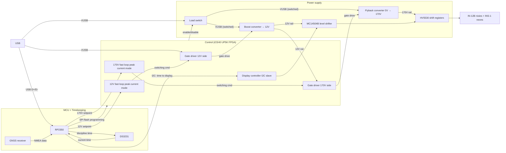

# Nixie Clock
 
A GNSS-disciplined nixie tube clock built around an iCE40 UP5K FPGA and an RP2350 MCU, driving IN-12B nixie tubes and INS-1 neon indicators from a custom high-voltage supply.
 
## Overview
 
This project combines classic Soviet-era nixie tube display technology with a modern mixed-signal control architecture. An FPGA handles the real-time, safety-critical work: fast peak-current-mode control of two independent switching converters and the high-voltage display drive. An RP2350 MCU manages USB, timekeeping, and slower supervisory tasks like voltage setpoints and GNSS time discipline.
 
## System architecture
 
- **Power**: A flyback converter steps 5V up to 170V for the nixie tubes, alongside a boost converter generating a 12V rail for gate drive and level shifting. Both converters run fast, cycle-by-cycle peak-current-mode control implemented in FPGA fabric, with slower outer-loop setpoints computed by the MCU from onboard ADC readings. An FPGA-controlled load switch gates VUSB to both converters for clean, controlled power sequencing.
- **Control**: The iCE40 UP5K FPGA runs the two independent fast control loops, their gate drivers, and a display controller that talks to the MCU over I2C to relay the current time to the display hardware.
- **Display drive**: MC14504B level shifters bridge logic-level signals up to the HV5530 high-voltage shift registers, which directly drive the IN-12B nixie tubes and INS-1 neon indicators.
- **Timekeeping**: A GNSS receiver provides NMEA time/date data and a 1PPS reference. The RP2350 parses NMEA sentences, handles timezone logic, and disciplines a DS3231 RTC, giving the clock accurate, power-loss-tolerant timekeeping without depending on a network connection.
## Why this design
 
Splitting the fast and slow control domains keeps the safety-critical converter regulation immune to software timing jitter. The FPGA's peak-current loops respond within a single switching cycle, while the MCU only needs to update setpoints occasionally. This keeps the fabric footprint small and pushes flash programming, USB handling, and time-sync logic onto the RP2350, where they're far easier to develop and iterate on.
 
## Status
 
Actively in development. Schematic design, power supply simulation, and system architecture are in progress.
 
## License
 
TBD

